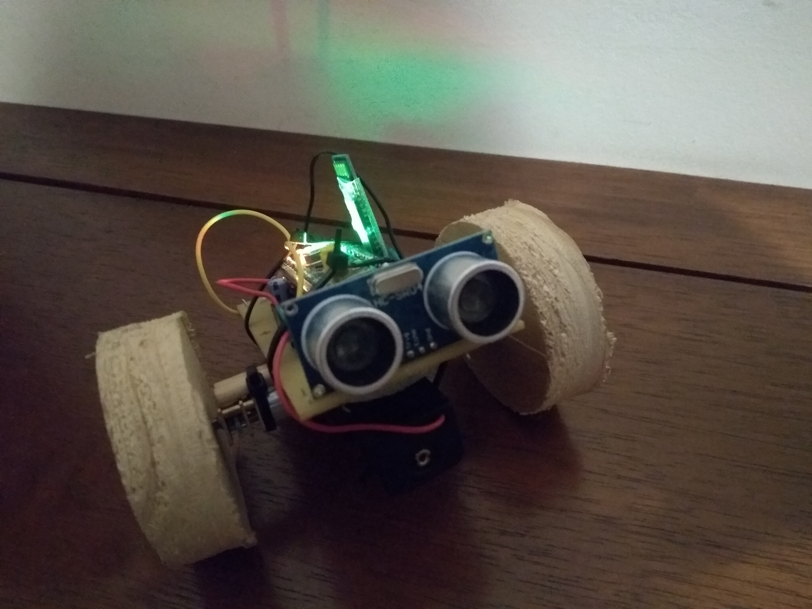

# Auto-bot (WIP)

## watch and build:
cargo watch -cx 'build --release'

## watch + upload :
cargo watch -cx 'flash --chip stm32f103C8 --release'

## Wireup

Bluetooth | STM32
-- | --
STATE | 
RXD   | B6
TXD   | B7
GND   | G
VCC   | 3.3
EN    | 

HC-SR04 | STM32
-- | --
Vcc     | +bat
Trig    | A6
Echo    | A4/B3
GND     | G

